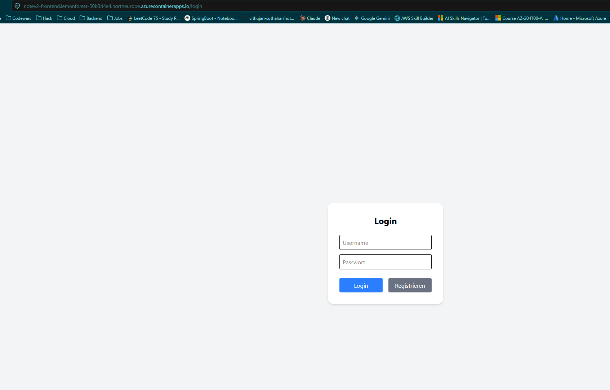
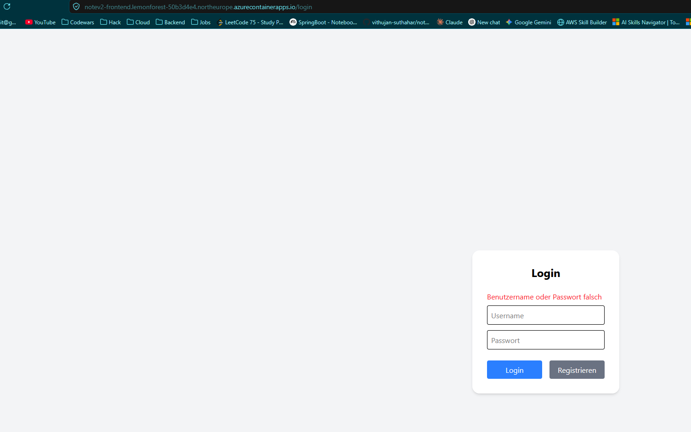
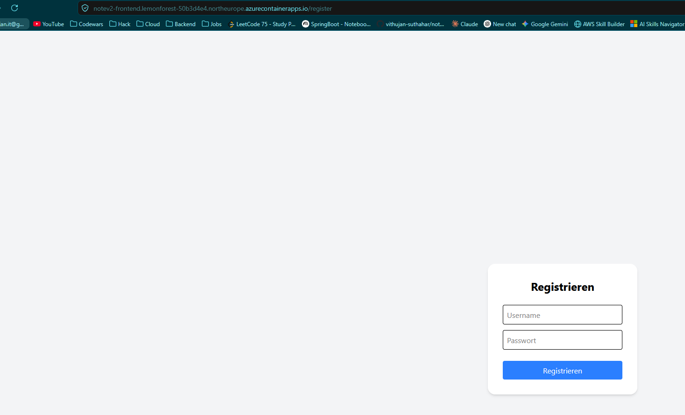
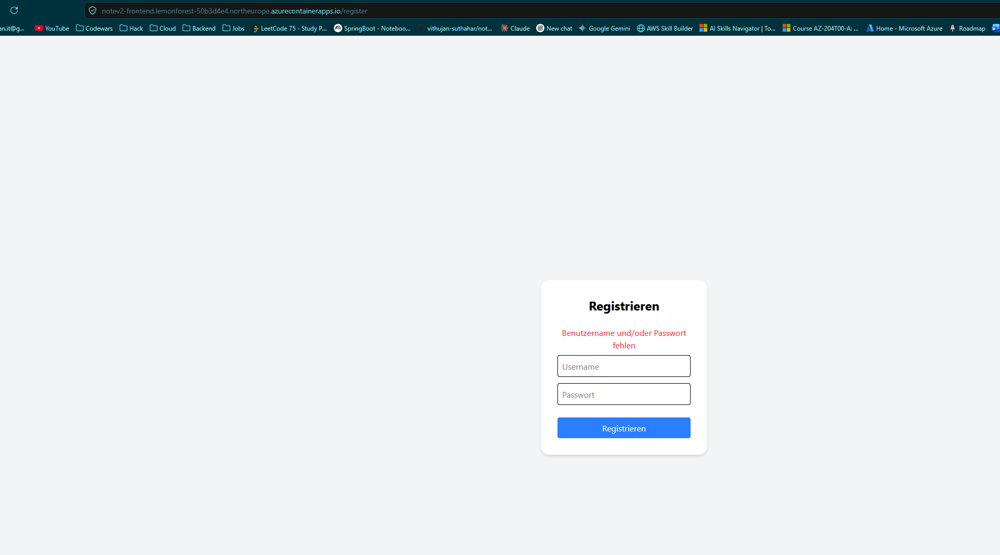
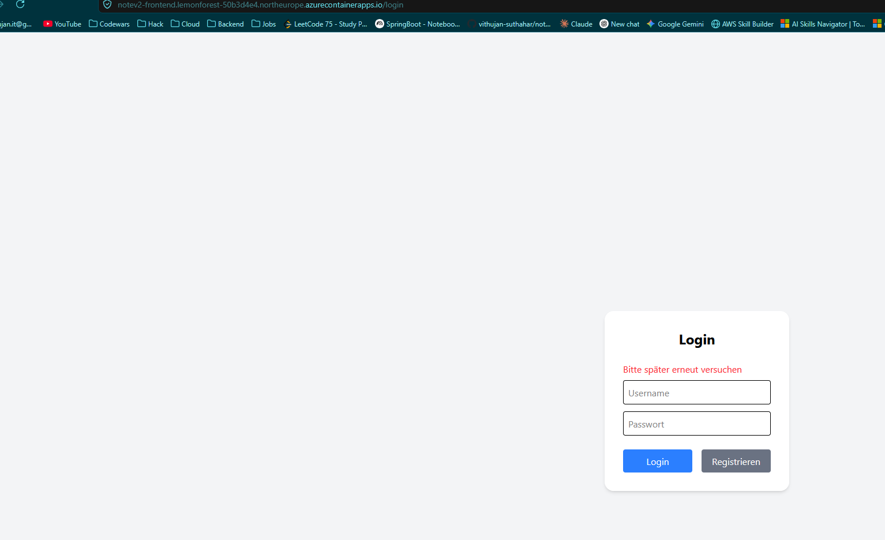
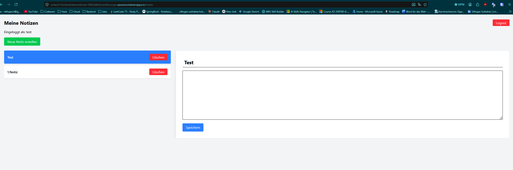
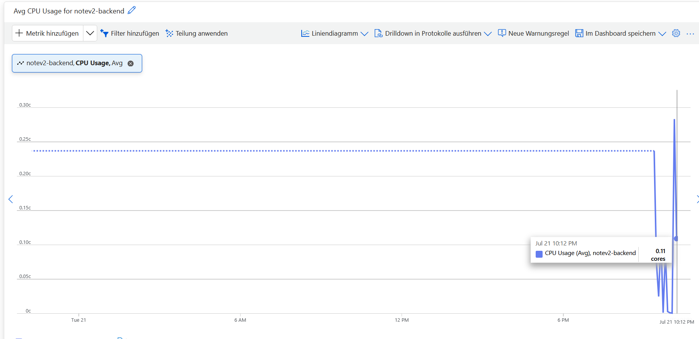

# Notizen App (Fullstack)

Eine Fullstack-Webanwendung zum Erstellen und Verwalten von Notizen mit Benutzer-Authentifizierung.

---

## Features

- JWT-basierte Authentifizierung (Login & Registrierung)
- Multi-User System – jeder Nutzer sieht ausschließlich eigene Notizen
- Notizen erstellen und löschen
- Geschützte API-Endpunkte via Spring Security
- Rate Limiting auf Auth-Endpoints (Schutz vor Brute-Force, Bucket4j)
- REST API für Frontend-Kommunikation

---

## Tech Stack

**Backend**
- Java 25, Spring Boot 4, Spring Security
- JWT (JSON Web Token)
- Bucket4j (Rate Limiting)
- PostgreSQL, JPA / Hibernate

**Frontend**
- React, Vite
- Axios, Tailwind CSS

---

## Projektstruktur

notev2/
├── notev2-backend/
│   ├── src/
│   └── pom.xml
├── notev2-frontend/
│   ├── src/
│   └── package.json
├── load-test.js
└── README.md

---

## Setup (lokal)

**1. Backend starten**

```bash
cd notev2-backend
$env:JWT_SECRET="your_secret_here"  
./mvnw spring-boot:run
```

**2. Frontend starten**

```bash
cd notev2-frontend
npm install
npm run dev
```

**Environment Variablen**

Erstelle eine `.env` Datei im Backend-Ordner (nicht committen):
JWT_SECRET=your_super_secret_key_mindestens_32_zeichen_lang

---

## API Endpoints

**Auth**

| Methode | Endpoint         | Beschreibung              |
|---------|------------------|---------------------------|
| POST    | /auth/register   | Benutzer registrieren     |
| POST    | /auth/login      | Login + JWT erhalten (rate-limited) |
| GET     | /auth/me         | Aktueller Benutzer        |

**Notes**

| Methode | Endpoint         | Beschreibung              |
|---------|------------------|---------------------------|
| GET     | /notes           | Alle Notizen des Nutzers  |
| POST    | /notes           | Neue Notiz erstellen      |
| DELETE  | /notes/{id}      | Notiz löschen             |

---

## Sicherheit

- Passwörter werden mit BCrypt gehasht
- JWT wird für Authentifizierung verwendet (mit Expiry & differenzierter Fehlerbehandlung)
- Geschützte Routen via Spring Security
- Rate Limiting (Token-Bucket-Algorithmus, Bucket4j) auf `/auth/login` und `/auth/register`, um Brute-Force-Angriffe zu erschweren
- Secrets werden über Environment Variablen verwaltet

---

## Performance Testing

Die REST API wurde lokal mit **Grafana k6** unter Last getestet.

### Testumgebung

- Backend: Spring Boot 4, Java 25
- Datenbank: PostgreSQL (Docker)
- Testtool: Grafana k6
- Testsystem: Lokaler Entwicklungsrechner

### Ergebnisse – `/notes` (ohne Rate Limiting, authentifizierte Requests)

| Metrik | 100 Virtual Users | 500 Virtual Users |
|--------|------------------:|------------------:|
| Dauer | 30 s | 30 s |
| Requests | 109.213 | 101.353 |
| Requests/s | 3.638 | 3.365 |
| Durchschnittliche Antwortzeit | 27,38 ms | 146,98 ms |
| p95 Antwortzeit | 83,56 ms | 331,69 ms |
| Maximale Antwortzeit | 282 ms | 1,43 s |
| Fehlerrate | 0 % | 0,64 % |

Beobachtung: Bei 500 VUs stieg die CPU-Auslastung des Spring-Boot-Containers auf ca. 450 % (≈ 4,5 Kerne), PostgreSQL auf ca. 100 %. Da `/notes` nicht rate-limited ist, verarbeitet jede Anfrage vollständig bis zur DB – das zeigt den DB-Connection-Pool als Flaschenhals unter hoher Last.

### Ergebnisse – `/auth/login` (mit Rate Limiting, 5 Requests/Min pro IP)

| Metrik | 100 Virtual Users |
|--------|------------------:|
| Dauer | 30 s |
| Requests | 359.731 |
| Requests/s | ~11.990 |
| Durchschnittliche Antwortzeit | 8,14 ms |
| p95 Antwortzeit | 15,38 ms |
| Anteil abgelehnt (429) | ~99,997 % |

Beobachtung: Rate Limiting greift bereits vor jeglicher Business-Logik/DB-Zugriff, wodurch Antwortzeiten und CPU-Last drastisch niedriger bleiben als bei ungeschützten Endpoints unter vergleichbarer Last.

### Test ausführen

```bash
k6 run load-test.js
```

---

## Deployment (Azure)

Die App wurde erfolgreich auf Azure Container Apps deployed (Backend, Frontend, PostgreSQL Flexible Server), provisioniert via Terraform.











---

### Beobachtungen beim Cloud-Loadtest



- Cold Start (min_replicas=0): Erster Request nach Idle-Zeit ~45s Latenz, 
  danach (warmer Container) ~109ms avg – klassischer Scale-to-Zero-Tradeoff.
- Rate Limiting funktioniert grundsätzlich, aber hinter Azures Reverse Proxy 
  liefert request.getRemoteAddr() die Proxy-IP statt der echten Client-IP – 
  alle Anfragen teilen sich effektiv denselben Bucket. Fix: Auswertung des 
  X-Forwarded-For-Headers (geplante Erweiterung).


---
## Geplante Erweiterungen

- Notizen bearbeiten
- Dark Mode
- Responsives Design verbessern
- Azure-Deployment mit Bicep/Terraform
- Redis-backed Rate Limiting für horizontale Skalierung

---

## Autor

Vithujan Suthahar